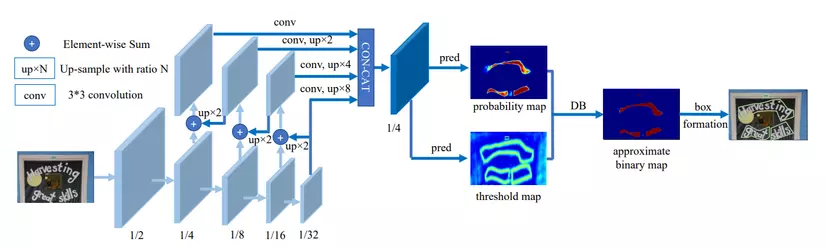
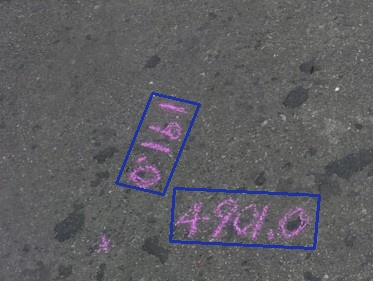

# TODO
1. Trainning scripts
2. SAHI for large scale detection
3. Scrip for text generation
# Text Binary Detection Paddle

# Requirements
paddlepaddle==3.0.0rc1
# Download weight 
```bash
mkdir weights
cd weights
wget https://github.com/phu2007vis/Paddle_Binary_Detection/releases/download/sdsd/det_r50_icdar15_v5.zip
unzip det_r50_icdar15_v5.zip
cd ..
```
# Replace weight path in tempate.yaml

# Test ( result save in visualize.jpg)
```bash
python main.py
```

